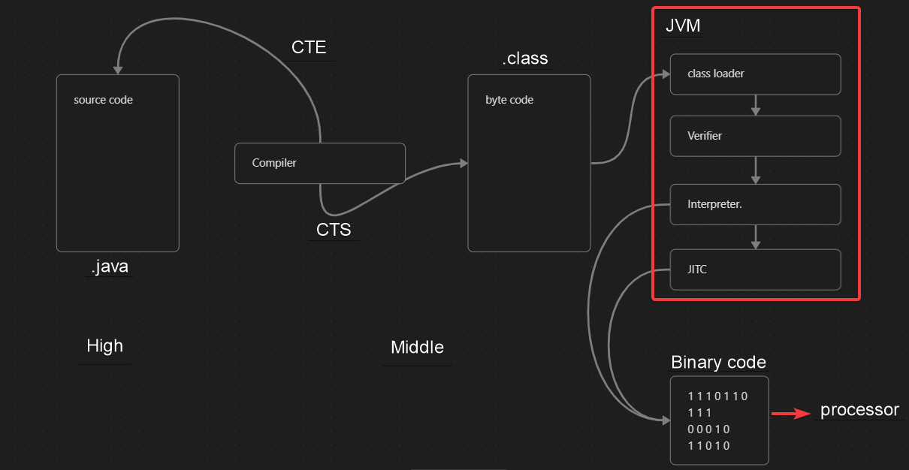
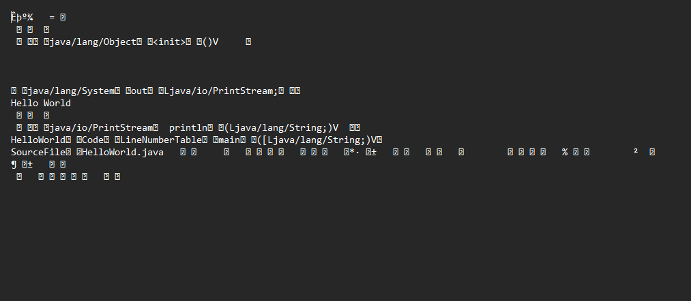
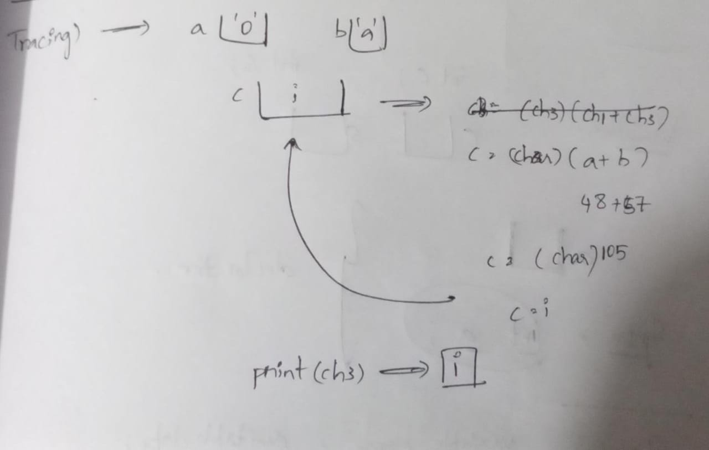

- [JAVA Basics](#java-basics)

  - [Definition](#defination)
  - [features-of-java](#features-of-java)
  - [levels-in-java](#levels-in-java)
  - [properties-of-java-file-execution](#properties-of-java-file-execution)
  - [java-architecture](#java-architecture)

---

- [Types of Codes](#types-of-codes)

  - [Source Code.](#source-code)
  - [Byte Code.](#byte-code)
  - [Binary Code.](#binary-code)

---

- [JDK JRE, JVM](#types-of-codes)

  [JDK](#jdk)

  [JRE](#jre)

  [JVM](#jvm)

  [JDK JRE JVM relation](#jdk-jre-jvm-relation)

---

- [Tokens](#tokens)

  - [Types of Tokens](#types-of-tokens)
  - [Keywords](#1-keywords)
  - [Identifiers](#2-identifiers)
  - [Literals](#3-literals)

---

- [JAVA structure](#java-structure)

  - [Syntax of JAVA.](#syntax-of-java)

---

- [Data Types](#data-types)

  - [Definition.](#definition)
  - [Primitive Datatypes.](#primitive-datatypes)
  - [Min and Max values of Primitive datatypes](#min-and-max-values-of-primitive-datatypes)
  - [Non-Primitive Datatypes.](#non-primitive-datatypes)

---

- [Variables](#variables)

  - [Definition of Variables.](#definition-of-variables)
  - [Properties of variables.](#properties-of-variables)
  - [1. Variable Declaration.](#1-variable-declaration)
  - [2. Variable Initialization.](#2-variable-initialization)
  - [3. Variable Utilization.](#3-variable-utilization)
  - [Code examples.](#code-examples)
  - [Error code Examples.](#error-code-examples)

---

- [Reinitialization](#reinitialization)
  - [Re-initialization](#re-initialization)

---

- [Types of Variables](#types-of-variables)
  - [Types of Variables](#types-of-variables-1)
  - [Local Variables](#local-variables)
  - [Data Members](#data-members)

---

- [Operator](#operator)
  - [Operator](#operator-1)
  - [Operands](#operands)
  - [Types of Operands](#types-of-operands)
  - [1. Unary Operator](#1-unary-operator)
  - [2. Binary Operator](#2-binary-operator)
  - [3. Ternary Operator](#3-ternary-operator)

---

- [List of Operators](#list-of-operators)
  - [List of Operators](#list-of-operators-1)
  - [+ (Addition)](#addition)
  - [Concatenation](#concatenation)
  - [- (Minus or Substraction)](#minus-or-substraction)
  - [\* , / , % Multiplication, division, modulus](#multiplication-division-modulus)
  - [double, int divisions](#double-int-divisions)
  - [Assignment operators](#assignment-operators)
  - [Compound Operators](#compound-operators)

---

- [Casting](#casting)

  - [Castig Definition](#casting-definition)

  - [1. Primitive casting](#1-primitive-casting)

  - [2. non-Primitive casting](#2-non-primitive-casting)

  - [Types of Primitive Casting](#types-of-primitive-casting)

    - [Widning Casting](#1-widening)
    - [Narrowing Casting](#2-narrowing)

  - [Types of non primitive Casting](#types-of-non-primitive-casting)

  - [Coding Examples](#coding-examples)

  - [Important for Interviews](#important-for-interviews)

  - [Assignment Example](#assignment-example)

---

- [Programming Problems](#programming-questions)

---

- [Relational Operators](#relational-operators)
  - [< and > Coding problems](#programming-problems-on--and--operators)
  - [<= and >= Coding problems](#programming-problems-on--and--operators)
  - [Assignment problems](#assignment-problems)

# Java Basics

## Defination.

Java is a high-level, general-purpose programming language that is designed to be

- portable,
- platform-independent, and
- easy to use.

It was developed by Sun Microsystems (now owned by Oracle Corporation) in the mid-1990s, and has since become one of the most popular programming languages in use today.

> James Gosling is the father of Java.

- The first version of Java is released in 1995, JDK 1.

## Features of JAVA.

Java is an Object Oriented Programming Language (OOPS).

## OOPS

in Java we are going to write the program based on orientation or features of the object.

OOPS in Java stands for Object-Oriented Programming System. Object-oriented programming (OOP) is a programming paradigm that is based on the concept of objects, which can contain data, in the form of fields, and code, in the form of methods.

In Java, everything is an object, and the language is designed to support the four fundamental principles of OOP:

1. Encapsulation: The process of hiding the implementation details of an object and exposing only the necessary information.
2. Inheritance: The ability of an object to inherit properties and methods from another object.
3. Polymorphism: The ability of an object to take on different forms or types.
4. Abstraction: The ability to represent complex real-world scenarios in a simplified manner.

By using OOP concepts in Java, developers can create modular, reusable, and maintainable code that is easier to understand and modify. OOP principles also help to reduce code duplication, increase code readability, and make code more efficient.

## High Level Language

Java is a high-level programming language, which means that it is designed to be easy to read and write, and to be used by humans rather than machines. Java provides a wide range of features that make it a high-level language, including:

1. encapsulation.
2. Inheritance.
3. Polymorphism.
4. Abstraction.

## MultiThreading

Java can support multithreading. We can run many things at a time.

Multithreading in Java refers to the ability of the Java programming language to execute multiple threads simultaneously within a single program. A thread is a unit of execution within a program, and multithreading allows a program to perform multiple tasks at the same time, which can improve performance and responsiveness.

## Platform Independent

Java is platform independent. We can write Java code in one system and we can run that code in any other system with different operating system if they having JDK installed.

Java's platform independence means that Java code can run on any platform that has a Java Virtual Machine (JVM) installed, without requiring changes to the code itself. This is achieved through the use of bytecode and the JVM, which provide a consistent environment for executing Java code across different platforms. This feature has made Java a popular choice for developing cross-platform applications, as it eliminates the need to write different code for different platforms, and ensures consistent behavior across different environments.

## Secured

Java is very secure language.

Java has a number of security features designed to protect against security threats, such as viruses, hackers, and malicious code. Some of the key security features in Java include:

1. Security Manager: Java provides a security manager that can be used to control the actions of Java applications and applets. The security manager can be configured to allow or deny certain actions, such as accessing the file system, creating network connections, or loading native code.
2. Bytecode Verification: Java bytecode is verified before it is executed by the JVM to ensure that it does not violate Java's type safety rules. This helps to prevent buffer overflows, stack overflows, and other common security vulnerabilities.
3. Class Loaders: Java uses a hierarchical class loader system to load classes into the JVM. This provides a level of isolation between different classes, and helps to prevent classes from accessing resources that they should not have access to.
4. Cryptography: Java includes a range of cryptographic libraries that can be used to encrypt and decrypt data, generate digital signatures, and perform other cryptographic functions.
5. Secure Communication: Java provides a range of APIs for performing secure communication over networks, including SSL/TLS, HTTPS, and SFTP.

Overall, Java's security features are designed to provide a secure and reliable platform for developing and deploying applications, and to protect against a wide range of security threats.

## Levels in JAVA.

- High Level (User / Programmer)
- Mid Level (Translator)
- Low Level (System)

⇒ user cannot understand low level language.

⇒ System cannot understand high level language.

⇒ compiler of JAVA is written in ‘C’ Language.

⇒ interpreter of JAVA is written in Python Language.

## Properties of Java file Execution.

1. Coding.

2. Compiling.

3. Executing.

- Coding.

  - We will write the code in high level language which can be understandable by user or programmer.
  - We need to save the file in .java format.
  - Java file is also known as source code.

- Compiler.

  - In compilation compiler will translate high level source code to middle level code.

  - We can expect to outputs from the compiler.

    CTE - Compile Time Error.

    CTS - Compile Time Success.

  1. CTE - (Compile Time Error).

  - When there is an error in the source code then we can expect compile time error from compiler.
  - When we are getting CTE we need to change the source code so that no errors will be there.
  - We need to save the file before giving to the compiler.

  2. CTS - (Compile Time Success).

  - After submitting the code to the compiler, if there are no errors at the time, we can expect CTS.
  - When we get CTS, we can expect a .class to be generated.
  - .class file is also known as byte code.
  - A unique code is going to be present as bytecode.`

- execution.

  - In execution process we are going to convert middle level language to low level language.
  - JVM will convert byte code to binary code.

## Java architecture.



JITC - Java in time compiler.

JVM - Java virtual machine.

After saving code is given to compiler. 2 outputs are expected CTE and CTS. only translator will understand middle level language. Byte code: It is a unique code.

JVM comes for execution process

⇒ classLoader - Loads the byte code.

⇒ Verifier - Verifies the byte code

⇒ Interpreter and JITC - works for middle language to low laguage and for byte code to binary code.

# Types of Codes

## Source Code.

- High level language
- Alphabets number special symbols are pressed
- Source code is in .java extension.
- Source code is physically existing

Source code in Java refers to the human-readable code that is written by programmers using the Java programming language. This code is then compiled into bytecode, which is a lower-level, machine-readable representation of the program that can be executed by the Java Virtual Machine (JVM).

Java source code is typically stored in text files with a ".java" extension, and it can be edited using a variety of text editors or integrated development environments (IDEs), such as Eclipse, IntelliJ IDEA, or NetBeans. Java source code is made up of classes, which are the fundamental building blocks of a Java program. Each class contains one or more methods, which are blocks of code that perform specific tasks.

Java source code can be organized into packages, which are collections of related classes. Packages can be used to group classes together and to avoid naming conflicts between classes with the same name.

Java source code is designed to be platform-independent, which means that it can be run on any platform that has a JVM installed. This is achieved through the use of bytecode, which is generated by the Java compiler and can be executed by any JVM, regardless of the platform it is running on.

```java
public class HelloWorld {
    public static void main(String[] args) {
        System.out.println("Hello, World!");
    }
}
```

## Byte Code.

- Make level language.
- Bytecode is a unique code
- Bytecode is in .class extension.
- Bytecode is physically existing.

Bytecode in Java refers to the machine-readable code that is generated by the Java compiler when it compiles Java source code. Bytecode is a low-level, platform-independent representation of the program that can be executed by the Java Virtual Machine (JVM).

When a Java program is compiled, the Java compiler translates the source code into bytecode, which is a sequence of instructions that can be executed by the JVM. The bytecode is stored in files with a ".class" extension, and it can be distributed to other computers without requiring the source code or recompilation.

The advantage of using bytecode is that it allows Java programs to be platform-independent. Because the bytecode is executed by the JVM, which is available on a wide range of platforms, a single set of bytecode can be run on any platform that has a JVM installed. This eliminates the need to compile the program for each platform, and ensures that the program behaves consistently across different environments.

Overall, bytecode is a key feature of the Java platform that helps to make it a popular choice for developing cross-platform applications.



## Binary Code.

- Low level language
- It consists of zeroes and ones
- No extension for binary code.
- It does not exist physically.

Binary code in Java refers to the low-level, machine-readable code that is generated by the Java compiler when it compiles Java source code into bytecode. Binary code is a sequence of 1s and 0s that represents the instructions and data used by the computer to execute the program.

The Java compiler generates binary code in the form of bytecode, which is then executed by the Java Virtual Machine (JVM). The JVM is responsible for translating the bytecode into machine code that can be executed by the computer's CPU.

Binary code is typically stored in files with a ".class" extension, and it can be distributed to other computers without requiring the original source code or recompilation. This is possible because the JVM is available on a wide range of platforms, and can execute the same bytecode on any platform that has a JVM installed.

Overall, binary code is an important component of the Java platform, as it allows Java programs to be compiled once and run on any platform, regardless of the underlying hardware and operating system.

---

# JDK, JRE, JVM.

## JDK.

JDK stands for Java Development Kit. It is a software development kit that contains the tools and components necessary for developing Java applications. The JDK includes the Java Runtime Environment (JRE), which is needed to run Java applications, as well as additional tools for compiling, testing, and debugging Java code.

Here are some of the main components of the JDK:

1. Java Compiler: The Java compiler (javac) is a tool that converts Java source code into bytecode that can be executed by the JVM.
2. Java Virtual Machine (JVM): The JVM is the component that executes Java bytecode. It is responsible for providing a runtime environment in which Java programs can run.
3. Java Runtime Environment (JRE): The JRE is a subset of the JDK that is required to run Java applications. It includes the JVM and other necessary components such as class libraries and runtime support files.
4. Java Development Tools: The JDK includes various development tools, such as the Java debugger (jdb), which helps developers debug their Java applications, and the JavaDoc tool, which generates documentation for Java code.
5. Libraries and APIs: The JDK includes a set of class libraries and APIs that provide developers with a rich set of functionality for building Java applications. These libraries and APIs cover a wide range of areas, such as networking, security, and user interface development.

In summary, the JDK is a comprehensive software development kit that provides developers with everything they need to build, test, and debug Java applications.

| Component          | Description                                             |
| ------------------ | ------------------------------------------------------- |
| JDK                | Java Development Kit                                    |
| Javac              | Compiles Java source code into bytecode                 |
| JVM                | Executes Java bytecode                                  |
| JRE                | Subset of the JDK needed to run Java applications       |
| Development Tools  | Debugging and other development tools                   |
| Libraries and APIs | Class libraries and APIs for building Java applications |

## JRE.

JRE (Java Runtime Environment): The JRE is a software bundle that provides the runtime environment for Java applications to run on a particular platform. It includes the Java Virtual Machine (JVM), which executes Java bytecode, as well as libraries and other components required to run Java applications. The JRE is used by end users to run Java applications on their computers.

The Java Runtime Environment (JRE) consists of several components, including:

1. Java Virtual Machine (JVM): The JVM is the core component of the JRE. It is responsible for interpreting and executing Java bytecode. The JVM provides a runtime environment in which Java programs can run, and it manages memory allocation and garbage collection.
2. Class Libraries: The JRE includes a set of class libraries that provide a range of functionality for Java applications. These libraries include the core Java API, which provides classes and interfaces for common programming tasks, such as input and output, networking, and threading.
3. Java Plugin: The JRE includes a web browser plugin that allows Java applets and applications to run within a web browser.
4. Java Web Start: Java Web Start is a technology that allows Java applications to be launched from a web page without the need for a web browser plugin. It provides an easy way to deploy and manage Java applications.
5. Java Deployment Tools: The JRE includes various deployment tools that help developers package and distribute Java applications.

Overall, the JRE provides a runtime environment in which Java applications can run, and it includes everything necessary for Java programs to execute, including the JVM and class libraries.

| Component        | Description                                                      |
| ---------------- | ---------------------------------------------------------------- |
| JRE              | Java Runtime Environment                                         |
| JVM              | Executes Java bytecode                                           |
| Class Libraries  | Provide functionality for Java applications                      |
| Java Plugin      | Allows Java applets and applications to run within a web browser |
| Java Web Start   | Technology for launching Java applications from a web page       |
| Deployment Tools | Tools for packaging and distributing Java applications           |

## JVM.

JVM stands for Java Virtual Machine. It is an abstract machine that provides a runtime environment in which Java bytecode can be executed. Java bytecode is the compiled code that is generated from Java source code and can be run on any platform that has a JVM installed.

When you run a Java program, the Java compiler first translates the source code into bytecode, which is a platform-independent format. The bytecode is then interpreted by the JVM at runtime, and executed on the target platform. This allows Java programs to be run on any platform that has a JVM installed, without needing to be recompiled for each platform.

The JVM provides many services to the Java program, such as memory management, garbage collection, and security. It also provides a standard set of libraries and APIs that can be used by Java programs to access system resources, such as files, network sockets, and databases.

Overall, the JVM provides a powerful and flexible platform for running Java programs, and helps to ensure that Java programs are portable, secure, and reliable across different platforms and environments.

1. Class Loader: The class loader is responsible for loading the Java classes into memory at runtime. It takes the bytecode generated by the Java compiler and loads it into memory so that the JVM can execute it.

2. Runtime Data Area: The runtime data area is where the JVM stores data while the Java program is running. It consists of several parts, including:

a. Heap: The heap is the memory area where Java objects are stored. It is managed by the garbage collector and automatically frees memory that is no longer being used by the program.

b. Method Area: The method area is where the JVM stores class structures and method bytecode.

c. Java Stack: The Java stack is where Java methods are executed. It keeps track of method calls and stores method arguments and local variables.

3. Execution Engine: The execution engine is responsible for executing the Java bytecode. It reads the bytecode from memory and executes it on the underlying hardware. The execution engine uses various optimization techniques to improve performance, such as just-in-time (JIT) compilation.

4. Security Manager: The security manager is a Java class that provides security by controlling access to system resources such as files, network sockets, and threads. It helps to prevent unauthorized access to sensitive data and protects against malicious code.

5. Just-In-Time (JIT) Compiler: The JIT compiler is a feature of the JVM that can improve the performance of Java applications. It compiles frequently executed sections of bytecode into native machine code at runtime, which can result in faster execution times.

6. Profiling and Debugging Tools: The JVM provides various profiling and debugging tools that help developers optimize their Java applications. For example, the Java Virtual Machine Profiler Interface (JVMPI) provides a set of APIs that allow developers to collect runtime performance data, while the Java Debug Interface (JDI) provides a way to remotely debug Java programs.

| Component                     | Description                                                       |
| ----------------------------- | ----------------------------------------------------------------- |
| JVM                           | Java Virtual Machine                                              |
| Bytecode Execution            | Executes Java bytecode                                            |
| Memory Management             | Allocates and deallocates memory for Java objects                 |
| Garbage Collection            | Removes unreferenced objects from memory                          |
| Security Manager              | Provides a security framework for Java applications               |
| Just-In-Time (JIT) Compiler   | Compiles bytecode to native machine code for improved performance |
| Profiling and Debugging Tools | Tools for monitoring and optimizing Java applications             |

source code

```java
public class HelloWorld {
    public static void main(String[] args) {
        System.out.println("Hello, World!");
    }
}
```

byte code


## JDK JRE JVM relation.


---

# Tokens

## Types of Tokens.

1. Keywords
2. Identifiers
3. Literals
4. Operators

## 1. Keywords.

- The words, which are already defined or predefined.
- All data types are keywords
- There are 50 plus keywords

## 2. Identifiers.

- Names given to Java components is known as identifiers.

- Examples are class variables methods interface packages constructor names.

- Rules-

  - Identifier can exist of alphabets and numerical values
  - It should not start with numbers
  - No symbols are allowed in the Identifiers.
  - Only ‘\_’ and ‘$’ signs are allowed.

- I T standard rules:

  - I T standard for classes
    - Class name should follow “Pascal case“
    - Example: Qspiders_Magic.
  - I T standard for methods / variables.
    - happy_Magic
    - manual_Testing
    - Only first word is a canal case. Later Pascal cases are followed.

## 3. Literals.

In Java, a literal is a value that appears directly in your code and represents a specific type of data, such as a number, a character, a string, or a boolean value.

For example, some common types of literals in Java include:

| Literal Type           | Example         |
| ---------------------- | --------------- |
| Integer Literal        | 42              |
| Integer Literal        | -15             |
| Integer Literal        | 0               |
| Floating-Point Literal | 3.14            |
| Floating-Point Literal | -2.5            |
| Floating-Point Literal | 0.0             |
| Character Literal      | 'A'             |
| Character Literal      | 'b'             |
| Character Literal      | '$'             |
| String Literal         | "Hello, World!" |
| String Literal         | "Java"          |
| String Literal         | "123"           |
| Boolean Literal        | true            |
| Boolean Literal        | false           |

Literals are constant values that cannot be changed during the execution of a program. They are useful when you need to assign a fixed value to a variable, or when you want to pass a value as an argument to a method or constructor.

## Number Literal

In Java, number literals are used to represent numeric values. There are two types of number literals:

1. integer literals
2. floating-point literals.

Integer literals are used to represent whole numbers. Here are some examples:

- 42, -15, 0, 123456789

Floating-point literals are used to represent numbers with fractional parts. Here are some examples.

- 3.14, -2.5, 0.0, 1.23

Number literals can be used in various ways in Java, such as assigning them to variables, passing them as arguments to methods, or using them in arithmetic expressions.

## Character Literal

In Java, a character literal is a way to represent a single character as a value in your code. Character literals are written as a single character enclosed in single quotes, such as

- 'A', 'b', or '$'.

Character literals are useful when you need to represent a single character value in your code, such as when working with strings or text processing.

## Strings Literal

In Java, a string literal is a way to represent a sequence of characters as a value in your code. String literals are written as a sequence of characters enclosed in double quotes, such as

- "Hello, World!", "Java", or "123".

String literals can contain any sequence of characters, including letters, numbers, punctuation, and whitespace. You can also use escape sequences in string literals to represent special characters, such as the newline character '\n', the tab character '\t', or the double quote character '"'.

## Boolean Literal

In Java, a boolean literal is a way to represent a boolean value as a value in your code. Boolean literals can have one of two values:

- **`true`** or **`false`**.

Boolean literals are commonly used in Java to represent logical values, such as the result of a comparison or a condition in a program. They are often used in control flow statements, such as **`if`** statements and loops, to determine the flow of a program based on the value of a boolean expression.

## difference between character literal and strings literal.

| Property      | String          | char        |
| ------------- | --------------- | ----------- |
| Empty Value   | Allowed         | Not Allowed |
| Minimum Value | Zero            | One         |
| Example Value | "Hello, world!" | 'A'         |
| Homogeneity   | Heterogeneous   | Homogeneous |

# Coding Examples for Literals

## Number Literal

```java
public class NumberLiterals {
    public static void main(String[] args) {
        System.out.println(42); // a number literal. prints the number to the console
    }
}
```

```java
public class NumberLiterals {
    public static void main(String[] args) {
        System.out.println(42);
        System.out.println(3.14159);
        System.out.println(1234567890L);
        System.out.println(2.5f);
        System.out.println(100);
        System.out.println(32767);
    }
}
```

## Character Literal

```java
public class CharacterLiterals {
    public static void main(String[] args) {
        System.out.println('A');
        System.out.println(' ');
        System.out.println('a');
        System.out.println('1');
        System.out.println('\\');
        System.out.println('$');
    }
}
```

## String Literal

```java
public class StringLiterals {
    public static void main(String[] args) {
        System.out.println("Hello, world!");
        System.out.println("She said, \\"Hello!\\"");
        System.out.println("C:\\\\Windows\\\\System32");
        System.out.println("First line.\\nSecond line.");
    }
}
```

**OutPut**

```vbnet
Hello, world!
She said, "Hello!"
C:\\Windows\\System32
First line.
Second line.
```

## Boolean Literal

```java
public class BooleanLiteral {
    public static void main(String[] args) {
        System.out.println(true);
        System.out.println(false);
    }
}
```

**OutPut**

```vbnet
true
false
```

---

# JAVA structure

## Syntax of JAVA.

```java
class My_first {
        public static void main(String[] args) {
                System.out.println("Hello World");
        }
}
```

In the above code.

- `class` is a Keyword.
- Inside the class, there is a main method.
  - `public static void main(String[] args) { // instructions }`
- There is a printing statement inside the main method
  - `System.out.println(”Hello World”);`

---

# Data Types

## Definition.

- It specifies the size and type of the data to be stored in the memory block
- It is divided into two types
  - Primitive data
  - non-Primitive data

## Primitive Datatypes.

The Data whose memory is already defined such data is known as Primitive data. There are 8 types of primitive data

- Number Data
  - Integer
    - byte
    - short
    - 💖int
    - long
  - Decimal
    - float
    - 💖double
- Characters
- Boolean

## Min and Max values of Primitive datatypes

| Data Type | Primitive/Non-primitive | Size (in bits) | Minimum Value              | Maximum Value             |
| --------- | ----------------------- | -------------- | -------------------------- | ------------------------- |
| boolean   | Primitive               | 1              | false                      | true                      |
| byte      | Primitive               | 8 (1 byte)     | -128                       | 127                       |
| short     | Primitive               | 16 (2 bytes)   | -32,768                    | 32,767                    |
| int       | Primitive               | 32 (4 bytes)   | -2,147,483,648             | 2,147,483,647             |
| long      | Primitive               | 64 (8 bytes)   | -9,223,372,036,854,775,808 | 9,223,372,036,854,775,807 |
| float     | Primitive               | 32 (4 bytes)   | 1.4E-45                    | 3.4028235E38              |
| double    | Primitive               | 64 (8 bytes)   | 4.9E-324                   | 1.7976931348623157E308    |
| char      | Primitive               | 16 (2 bytes)   | '\u0000' (0)               | '\uffff' (65,535)         |

## Non-Primitive Datatypes.

⇒ The data whose memory will be allocated by JVM. Examples for non-primitive Data. Because during run time, memory is allocated.

- String
- arrays
- objects
- class data

Non-Primitive data is also known as class type of data.

In non-primitive data, we can store more than one value.

---

# Variables

## Definition of Variables.

- Variable is a Memory block used to store data
- With the help of variables, we can reuse the data multiple times.
- By using variables, we can manipulate the data.

## Properties of variables.

There are three main Properties.

1. Variable declaration
2. Variable Initialization
3. Variable Utilization.

## 1. Variable Declaration.

Creating a Memory block with type , size and name of the memory block.

Syntax

> Datatype variable name;

```java
int a;
```

Datatype: type and size

variable name: Identifier, CamelCase.

## 2. Variable Initialization.

Assigning the value to the memory block based on the size of variable.

Syntax

> Datatype variablename = suitable Data;

```java
int a = 240;
```

> variablename = Suitable Data;

```java
a = 240;
```

Variable name : Identifier.

Suitable Data: Value.

- Example codes.

  ```java
  char S1 = '@';                  // Example code of Character
  String S2 = "Hello World";      // Example code of String
  boolean s3 = false;             // Example code of Boolean (false is the default value)
  ```

## 3. Variable Utilization.

Using the Already declared and initialized data.

Example code.

```java
System.out.println(a);
```

## Code examples.

```java
public class Variables {
    public static void main(String[] args) {
        int a;                              // Variable Declaration
        a = 240;                            // Variable Initialization
        System.out.println(a);              // Variable Utilization
                                            // For Declaration, Initialization is required
                                            // For Initialization, Declaration is required

        String s1 = "Happy Birthday";       // Variable initialization
        System.out.println(s1);
    }
}
```

**Output**

240

Happy Birthday

---

## Error code Examples.

- only \_ cannot be used

  ```java
  public class Literals {
      public static void main(String[] args) {
          short _ = 420;
          System.out.println(_);
      }
  }
  ```

  **output**

  `java: as of release 9, '_' is a keyword, and may not be used as an identifier`

- \_$ can be used

  ```java
  public class Literals {
      public static void main(String[] args) {
          short _$ = 420;
          System.out.println(_$);
      }
  }
  ```

---

# Reinitialization

## Re-initialization

Reassigning or changing the old data with new suitable data.

```java
public class Literals {
    public static void main(String[] args) {
        int a = 20;
        System.out.println(a);
        a = 30;
        System.out.println(a);
    }
}
```

**Output:**

20

30

### Tracing

int a = 20;

a = |20|

print(a) → 20;

a = 30;

a = |~~20|~~ → |30|

print(a) → 30;

NOTE

- In JAVA re-inintialization is possible, but re-declaration is not possible. Because JAVA does not allow duplicate memory blocks

- Re-initialization Coding example.

  ```java
  public class Literals {
      public static void main(String[] args) {
          int a = 10;
          System.out.println(a);
          a = 20;
          System.out.println(a);
      }
  }
  ```

  **Output**

10

20

- Re-declaration Coding example.

  ```java
  public class Literals {
      public static void main(String[] args) {
          int a = 10;
          System.out.println(a);
          int a = 20;
          System.out.println(a);
      }
  }
  ```

  **Output**

  `java: variable a is already defined in method main(java.lang.String[])`

---

# Types of Variables

## Types of Variables

There are two types of variables.

1. Local Variables.
2. data member

## Local Variables

Declaring a variable inside a particular block / method / constructor. There only we can access that particular variable. Such variable is known as Local variable.

## Data Members

Declaring a variable outside the method and inside the class. Such variable is known as Data members.

- There are two types of Data Members.
  - Static Variable (class variable).
  - non-static variable (object or instance variable).

---

# Operator

## Operator

Operator is a Symbol which uses the data to perform a specific task.

Example: + , - , > , < , / , = , ≠.

## Operands

The data which is used by the operator. Such data is known as operands.

Example : a = 20

`=` is an operand.

## Types of Operands

There are 3 types of Operators.

1. Unary Operator.
2. Binary Operator.
3. ternary Operator.

## 1. Unary Operator

An operator which is using only one operand called as Uniry Operator.

Example : a = 20, b = i++.

## 2. Binary Operator

An operator which uses only two operands called as Binary Operator.

Example : 20 + 30, 20 < 30.

## 3. Ternary Operator

An operator which uses two operands, more than three operands called as Ternary Operator.

Example : Conditional Operator.

---

# List of Operators

## List of Operators

1. Arthematic operators
   1. +(Addition).
   2. -(Minus or Subtraction).
   3. \*(Multiplication).
   4. / (division).
   5. % (modulus).

## + (Addition)

1. Addition.
2. Concatenation.

Case 1:

- integer + integer = integer.
- Process is addition.
- Example

```java
class Example{
        public static void main(String[] args) {
                int a = 10;
                int b = 20;
                int res;
                res = a + b;
                System.out.println(res);
        }
}
```

**Output**

30

Case 2:

- int + char = int
- Process is addition.
- Example

```java
public class Literals {
    public static void main(String[] args) {
        int a = 99;
        char ch = 'A';
        int res = a + ch;
        System.out.println(res);
    }
}
```

**Output**

164

## ASCii Values

1. 0-9

- 0 - 48
- 9 - 57

2. A-Z

- A - 65
- Z - 90

3. a-z

- a - 97
- z - 122

## Concatenation

- merging two different data's or two Strings data is known as concatenation.
- Output of this process is a “string” data.

## - (Minus or Substraction)

- Write a program to print the substraction of starting and end ranges of uppercase characters.

```java
public class Substraction {
    public static void main(String[] args) {

       char ch1 = 'A';
             char ch2 = '2';
             int a = ch1 - ch2;          // 65 - 90
             System.out.println(a);

    }
}
```

**Output**

`-25`

## \* , / , % (multiplication, Division, Modulus)

- write a program to print all 3 operations mentioned above. With a, Ch1, ch2.

  ```java
  public class Operators {
      public static void main(String[] args) {
          int a = 2;
          char ch1 = 'A';
          char ch2 = 'a';
          int res;

          res = ch1 * a;
          System.out.println(res);

          res = ch2 * a;
          System.out.println(res);

          res = ch1 / a;
          System.out.println(res);

          res = ch2 / a;
          System.out.println(res);

          res = ch1 % a;
          System.out.println(res);

          res = ch2 % a;
          System.out.println(res);
      }
  }
  ```

  **Output:**

  130 194 32 48 1 1

  ***

  ```java
  public class g {
      public static void main(String[] args) {

          double a1 = 2.0;

          int a = 2;
          char ch1 = 'A';
          char ch2 = 'a';
          int res;

          res = ch1 * a;
          System.out.println(res);

          res = ch2 * a;
          System.out.println(res);

          res = ch1 / a;
          System.out.println(res);

          res = ch2 / a;
          System.out.println(res);

          res = ch1 % a;
          System.out.println(res);

          res = ch2 % a;
          System.out.println(res);

          double res1 = ch1 % a1;
          System.out.println(res1);

          double res2 = ch2 % a1;
          System.out.println(res2);
      }
  }
  ```

  **Output:**

  130 194 32 48 1 1 1.0 1.0

## double, int divisions

- case1

  $double/double$

  When two double values are divided, the result will be a double value:

  ```java
  double g = 5.0;
  double h = 2.0;
  double result = g / h; // result will be 2.5
  ```

- case2

  $double / int$

  Similarly, when a double value is divided by an int value, the result will also be a double value:

  ```java
  double c = 10.0;
  int d = 3;
  double result = c / d; // result will be 3.33333...
  ```

- case3

  $int/double$

  When an int value is divided by a double value or vice versa, the result will always be a double value. For example:

  ```java
  int a = 5;
  double b = 2.0;
  double result = a / b; // result will be 2.5
  ```

- case4

  $int/int$

  When two int values are divided, the result will be an int value rounded towards zero. For example:

  ```java
  int e = 10;
  int f = 3;
  int result = e / f; // result will be 3
  ```

## Extra information on web.

Assuming that **`a`** and **`b`** are both **`int`** values:

```java
int a = 5;
int b = 2;

int divisionResult = a / b; // divisionResult will be 2
int modulusResult = a % b; // modulusResult will be 1
```

The result of the division operation will be an **`int`** value because both operands are **`int`**. When you divide two **`int`** values, the result is an **`int`** value rounded towards zero. The result of the modulus operation will also be an **`int`** value.

Now assuming that **`a`** and **`b`** are both **`double`** values:

```java
double a = 5.0;
double b = 2.0;

double divisionResult = a / b; // divisionResult will be 2.5
double modulusResult = a % b; // modulusResult will be 1.0
```

The result of the division operation will be a **`double`** value because both operands are **`double`**. When you divide a **`double`** value by another **`double`** value, the result is a **`double`** value. The result of the modulus operation will also be a **`double`** value.

In summary, the datatype of the output for the division and modulus operations will depend on the datatype of the operands involved. When both operands are **`int`**, the output will be an **`int`** value. When both operands are **`double`**, the output will be a **`double`** value.

In summary, the datatype of the output for the division and modulus operations will depend on the datatype of the operands involved. When both operands are **`int`**, the output will be an **`int`** value. When both operands are **`double`**, the output will be a **`double`** value.

If **`a`** and **`b`** are of different data types (**`int`** and **`double`**), then the data type of the result will be the wider data type of the two operands, which is **`double`**. This is known as type promotion in Java.

```java
int a = 5;
double b = 2.0;

double divisionResult = a / b; // divisionResult will be 2.5
double modulusResult = a % b; // modulusResult will be 1.0
```

In this case, the result of the division operation will be a **`double`** value because one of the operands is **`double`**. The result of the modulus operation will also be a **`double`** value.

Note that when an **`int`** value is divided by a **`double`** value, the **`int`** value is implicitly converted to a **`double`** value before the division is performed. This is another example of type promotion in Java.

When a **`double`** is divided by an **`int`**, the result will be a **`double`** value.

```java
double a = 5.0;
int b = 2;

double divisionResult = a / b; // divisionResult will be 2.5
double modulusResult = a % b; // modulusResult will be 1.0
```

In this case, the **`int`** value **`b`** is automatically promoted to a **`double`** value before the division is performed. This is because division between a **`double`** value and an **`int`** value results in a **`double`** value.

Similarly, the modulus operator **`%`** also results in a **`double`** value because the **`%`** operator works with the same rules as the division operator **`/`**.

---

## Assignment operators

Assignment operator is used to assign the values from right side to left side by using equals ( = ) operator.

Example:

`int a = 8;`

---

## Compound Operators

The operators, which are merged with assignment operator, is known as compound operators.

Example:

+=

-=

\*=

/=

%=

- Write a program to print the a value after and before assigning with itself by arithmetic compound operator.

  ```java
  public class Example {
      public static void main(String[] args) {
          int a = 10;
          System.out.println(a);
          a += a;
          System.out.println(a);
      }
  }
  ```

  **Output:**

  10

  20

  ***

- Write a program to convert given character to lower case and print that lower case character. And again, convert it into upper case character, print the output again.

  ```java
  public class Example {
      public static void main(String[] args) {
          char ch = 'A';
          System.out.println(ch);
          ch += 32;
          System.out.println(ch);
          ch -= 32;
          System.out.println(ch);
      }
  }
  ```

  **output:**

  A

  a

  A

- The compound operator is used to increment the number or the character to itself.

- In the above code, the ANCii value of character ‘A’ is 65. We can convert that upper case ‘A’ to smaller case ‘a’ by adding 32 to that character.

- By subtracting 32 to the character value of ‘a’, we can convert lower case ‘a’ to upper case ‘A’.

---

# Casting

## Casting definition

Converting one type of data to another type of data. There are two types of casting.

1. Primitive casting
2. Non primitive casting.

## 1. Primitive casting

Converting the one primitive data to another primitive data is known as primitive casting.

## 2. Non primitive casting

Converting one **non primitive data** to another **non primitive data** is known as **non primitive casting**.

---

## Types of Primitive casting

1. Widening
2. narrowing

---

## Types of non primitive casting

1. Up casting
2. Down casting.

---

### 1. Widening

Converting the **_smaller data_** type to **_larger data_** type is known as `Widening`.

It is also known as the `implicit casting`.

**Example:**

```java
  double d = 2;
  System.out.println(d); // 2.0
```

**Output:**
2.0

- 2 → 2.0
- from **int** to **double**

### 2. Narrowing

Converting the **_Larger data type_** to **_smaller data type_** is known as a `narrowing`

It is also known as `explicit casting`.

Example:

```java
  int i = (int)2.9;
  System.out.println(i); // 2
```

**Output:**
2

**`NOTE`**: In narrowing, data loss is there.

---

### Coding Examples

#### Implicit casting

```java
  class Example {
    public static void main(String[] args) {
        char ch = 'A';
        ch = ch + 1;
        System.out.println(ch);
    }
}
```

**Output:**
`Type mismatch: cannot convert from int to char.`

int size = 4.
char size = 2.

4 ↛ 2.

---

#### Explicit Casting

```java
class Example {
    public static void main(String[] args) {
        char ch = 'A';
        ch = (char) (ch + 1);
        System.out.println(ch);
    }
}
```

**Output:**
B

---

#### Implicit casting happening explicitly.

```java
  class Example {
    public static void main(String[] args) {
        char ch = 'A';
        ch += 1;
        System.out.println(ch);
    }
}
```

## `Important for Interviews`

| case1               | case2                 |
| ------------------- | --------------------- |
| **_ch = ch + 1_**   | **_ch = 66_**         |
| - stored input      | - direct input        |
| - Explicit Casting  | - Implicit casting    |
| - Error will occur. | - No error will occur |

---

## Assignment Example

Write a program to print the sum of two character data.

```java
  class Example {
    public static void main(String[] args) {
        char a = '0';
        char b = '9';
        char c = (char) (a + b);
        System.out.println(c);
    }
}
```

**Output:**
i

**Tracing:**



---

# Programming Questions

1. Write a program to print the sum of first three numbers and last three numbers in the given data.

   ```java
   public class Solution {
       public static void main(String[] args) {
           int a = 23;
           int b = 34;
           int c = 45;
           int d = 56;
           int e = 67;

           System.out.println("\n");

           System.out.println(
                   "Sum of 1st three numbers is: " + (a + b + c) + " and \nSum of last three numbers is: " + (c + d + e));
       }
   }
   ```

   **OutPut**

   ```vbnet
   Sum of 1st three numbers is: 102 and
   Sum of last three numbers is: 168
   ```

2. Write a program to print the product of sum of first three numbers and difference of last three numbers.

   ```java
   public class Solution {
       public static void main(String[] args) {
           int a = 23;
           int b = 34;
           int c = 45;
           int d = 56;
           int e = 67;

           System.out.println("\n");

           System.out.println("The product of sum of 1st 3 numbers and difference of last three numbers are" + ((a + b + c)*(c - d - e)));
       }
   }
   ```

   **OutPut**

   ```vbnet
   The product of sum of 1st 3 numbers and difference of last three numbers are-7956
   ```

3. Write a program to print the difference of sum of 1st 4 numbers and product of last three numbers.

   ```java
   public class Solution {
       public static void main(String[] args) {
           int a = 23;
           int b = 34;
           int c = 45;
           int d = 56;
           int e = 67;

           System.out.println("\n"); // \n is for empty line.

           System.out.println("Sum of 1st four numbers is: " + (a + b + c + d) + " and \nProduct of last three numbers is: " + (c * d * e));
           System.out.println("The Difference is: " + ((a + b + c + d) - (c - d - e)));
       }
   }
   ```

   **OutPut**

   ```vbnet
   Sum of 1st four numbers is: 158 and
   Product of last three numbers is: 168840
   The Difference is: 236
   ```

4. Write the program to print the quotient of sum of 1st four numbers and difference of last two numbers.

   ```java
   public class Solution {
       public static void main(String[] args) {
           int a = 23;
           int b = 34;
           int c = 45;
           int d = 56;
           int e = 67;

           int add = a + b + c + d;
           int diff = d - e;
           int quot = add / diff;

           System.out.println("The Sum of " + a + "," + b + "," + c + "," + d + " is: " + add + "\nand Difference of " + d + " and " + e + " is: " + diff);
           System.out.println("The Quotient of " + add + " and " + diff + " is: " + quot);
       }
   }
   ```

   **OutPut**

   ```vbnet
   The Sum of 23,34,45,56 is: 158
   and Difference of 56 and 67 is: -11
   The Quotient of 158 and -11 is: -14
   ```

5. Write a program to print the sum of last three vowel characters.

   ```java
   public class Solution{
       public static void main(String[] args) {
           char a = 'I';
           char b = 'O';
           char c = 'U';

           System.out.println("Sum of last three vowels " + a + "," + b + "," + c + " is: " + (a + b + c));
       }
   }
   ```

   **OutPut**

   ```vbnet
   Sum of last three vowels I,O,U is: 237
   ```

6. Write a program to print the sum of starting ranges of digit, upper case Alphabet. characters, lower case Alphabet characters.

   ```java
   public class Solution {
       public static void main(String[] args) {
           char ch1 = '0';
           char ch2 = 'A';
           char ch3 = 'a';

           char res = (char) (ch1 + ch2 + ch3);

           System.out.println("Sum of " + ch1 + "," + ch2 + "," + ch3 + " is: " + res);
       }
   }
   ```

   **OutPut**

   ```vbnet
   Sum of 0,A,a is: ?
   ```

7. Write a program to print the difference of ending ranges of alphabets and numbers.

   ```java
   public class Solution {
       public static void main(String[] args) {
           char ch1 = 'z';
           char ch2 = '9';

           char res = (char) (ch1 - ch2);

           System.out.println("The Difference of " + ch1 + " and " + ch2 + " is: " + res);
       }
   }
   ```

   **OutPut**

   ```vbnet
   The Difference of z and 9 is: A
   ```

8. Write a program to print the product of sum of first three vowel characters and difference of starting ranges of digit, lower case alphabet and sum of end ranges of digit lower case Alphabet

   ```java
   public class Solution {
       public static void main(String[] args) {
           char ch1 = 'A';
           char ch2 = 'E';
           char ch3 = 'I';

           char ch4 = '0';
           char ch5 = 'a';

           char ch6 = '9';
           char ch7 = 'z';

           System.out.println("\n");

           System.out.println("The sum of " + ch1 + "," + ch2 + "," + ch3 + " is: " + (ch1 + ch2 + ch3) + ". "
                   + "\nThe difference of " + ch4 + "," + ch5 + " is: " + (ch4 - ch5) + ". " + "\nThe sum of " + ch6 + ","
                   + ch7 + " is: " + (ch6 + ch7));

           System.out.println("\n");

           System.out.println("Product of " + (ch1 + ch2 + ch3) + " and " + (ch4 - ch5) + " and " + (ch6 + ch7) + " is: "
                   + (((ch1 + ch2 + ch3) * (ch4 - ch5) * (ch6 + ch7))));
       }
   }
   ```

   **OutPut**

   ```vbnet
   The sum of A,E,I is: 207.
   The difference of 0,a is: -49.
   The sum of 9,z is: 179

   Product of 207 and -49 and 179 is: -1815597
   ```

9. Write a program to print the character based on the ascii value. Let the value be 65.

   ```java
   public class Implicit_Casting {
       public static void main(String[] args) {
           char ch = 65;
           System.out.println(ch);
           System.out.println("The Character with the Ascii value of 65 is " + ch);
       }
   }
   ```

   **OutPut**

   ```vbnet
   A
   The Character with the Ascii value of 65 is A
   ```

   ```java
   public class Explicit_Casting {
       public static void main(String[] args) {
           int ch = 65;
           char ch1 = (char) ch;
           System.out.println("The Character with the Ascii value of " + ch + " is " + ch1);
       }
   }
   ```

   **OutPut**

   ```vbnet
   The Character with the Ascii value of 65 is A
   ```

10. Write a program to print the character with Ancii value of the sum of 1st and last digit characters.

    ```java
    public class Solution {
        public static void main(String[] args) {
            char ch1 = '0';
            char ch2 = '9';
            char res = (char) (ch1 + ch2);

            System.out.println("The character is: " + res);
        }
    }
    ```

    **OutPut**

    ```vbnet
    The character is: i
    ```

11. Write a program to print the character with Ancii value of the sum of starting and end ranges of UpperCase alphabets ( - ) minus the sum of starting and end range of lower case alphabets.

    ```java
    public class Solution {
        public static void main(String[] args) {
            char a = 'A';
            char b = 'Z';

            char c = 'a';
            char d = 'z';

            int sum = a + b;
            int diff = c + d;

            int res1 = sum - diff;

            char res = (char) (sum - diff);

            System.out.println(res1);
            System.out.println("This is the result: " + res + ". as the number " + res1 + " is negative");
        }
    }
    ```

    **OutPut**

    ```vbnet
    -64
    This is the result: ?. as the number -64 is negative
    ```

---

# Relational operators.

Relational operators are used to compare the 2 data types which will give input as number data.

- Output of the relational data is always Boolean data.
- Comparison will happen from LHS to RHS.
- They are.

  - \>
  - <
  - \>=
  - <=
  - ==
  - !=

  ***

  ## Programming problems on < and > operators.

  1. Write a program to check `greatest among` the given inputs. Let inputs be `10, 9`.

     ```java
     public class Solution {
       public static void main(String[] args) {
          int a = 10;
          int b = 9;
          boolean c = a > b;

          System.out.println("a is greater than b : " + c);
       }
     }
     ```

     **Output**

     ```vbnet
     a is greater than b : true
     ```

  2. Write a program to check `smallest number` in the Among 2 numbers.

     ```java
     public class Solution {
       public static void main(String[] args) {
        int a = 10;
        int b = 19;
        boolean a = a < b;
        System.out.println("a is less than b : " + a);
       }
     }
     ```

     **Output**

     ```vbnet
     a is less than b : true
     ```

  ***

  ## Programming problems on <= and >= operators.

  1. Write a program to check whether the given inputs are `equal or Great or less`? Let the inputs are A and A.

     ```java
       public class Solution {
         public static void main(String[] args) {
            char a = 'A';
            char b = 'a';
            int c = 67;
            boolean d = a >= a;
            boolean e = a <= a;

            boolean f = a >= b;
            boolean g = a <= b;

            boolean h = a >= c;
            boolean i = a <= c;

            System.out.println(d);
            System.out.println(e);

            System.out.println(f);
            System.out.println(g);

            System.out.println(h);
            System.out.println(i);
        }
     }
     ```

     **Output**

     ```vbnet
     true
     true
     false
     true
     false
     true
     ```

  2. Write a program to check whether the given input is `>=` remaining 3 inputs.

     ```java
       public class Solution {
         public static void main(String[] args) {
           char ch1 = 'O';
           char ch2 = 'o';
           char ch3 = '0';

           boolean b1 = ch1 >= ch1;
           boolean b2 = ch1 >= ch2;
           boolean b3 = ch1 >= ch3;

           System.out.println(b1);
           System.out.println(b2);
           System.out.println(b3);
         }
       }
     ```

     **Output**

     ```vbnet
     true
     false
     true
     ```

  3. Write a program to check whether the given inputs are `equal or not`.

     ```java
     public class Solution {
       public static void main(String[] args) {
          int a = 90;
          int b = 10;

          boolean c = a == b;
          boolean d = a != b;

          System.out.println(c);
          System.out.println(d);
       }
     }
     ```

     **Output**

     ```vbnet
     false
     true
     ```

  ***

  ## Assignment problems.

  1. Write a program to check a = `90`. Weather the given input is `even or not`.

     ```java
     public class Solution {
       public static void main(String[] args) {
          int a = 90;
          boolean b = a % 2 == 0;
          System.out.println(b);
       }
     }
     ```

     **Output**

     ```vbnet
     true
     ```

  2. Write a program to check whether the given input is `even or not`. The input is a = `90`.

     ```java
     public class Solution {
       public static void main(String[] args) {
        int a = 91;
        boolean b = a % 2 == 0;

        System.out.println(b);
       }
     }
     ```

     **Output**

     ```vbnet
     false
     ```

  3. Write a program to check whether the given character ASCII value is `odd or not`. Let the input character be `'Z'`.

     ```java
     public class Solution {
       public static void main(String[] args) {
        char a = 'Z';
        boolean b = (a % 2 == 0);

        System.out.println("Ascii value of " + a + " is " + (int) a + " which is: " + b);
       }
     }
     ```

     **Output**

     ```vbnet
     Ascii value of Z is 90 which is: true
     ```

  4. Write a program to check whether the given character ASCII value is `odd or not`. Let the character be Uppercase `Z`.

     ```java
     public class Solution {
       public static void main(String[] args) {
        char a = 'Z';
        boolean b = (a % 2 == 1);

        System.out.println("Ascii value of " + a + " is " + (int) a + " which is: " + b);
       }
     }
     ```

     **Output**

     ```vbnet
     Ascii value of Z is 90 which is: false
     ```

  5. Write a program to check the sum of starting and ending ranges of digit characters is `even or not`.

     ```java
     public class Solution {
       public static void main(String[] args) {
          char ch1 = '0';
          char ch2 = '9';

          int i = ch1 + ch2;
          boolean bool = i % 2 == 0;

          System.out.println(bool);
       }
     }
     ```

     **Output**

     ```vbnet
     false
     ```

  6. Sum of Starting ranges of upper and lower case alphabets is `odd or not`.

     ```java
     public class Solution {
       public static void main(String[] args) {
          char ch1 = 'A';
          char ch2 = 'a';

          int i = ch1 + ch2;
          boolean bool = i % 2 == 0;

          System.out.println(bool);
       }
     }
     ```

     **Output**

     ```vbnet
     true
     ```

  7. Write a program to check the difference of all starting ranges of alphabets and digits is `odd or not`.

     ```java
     public class Solution {
       public static void main(String[] args) {
          char ch2 = 'a';
          char ch1 = 'A';
          char ch3 = '0';

          int i = ch1 - ch2 - ch3;
          boolean bool = i % 2 == 0;

          System.out.println(bool);
       }
     }
     ```

     **Output**

     ```vbnet
     true
     ```

---
